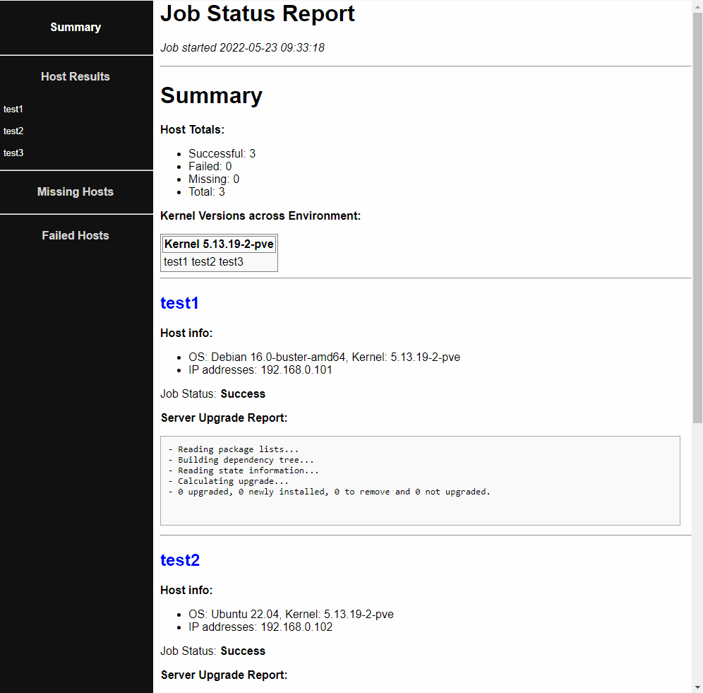

# Upgrade servers using Ansible and send a report after finishing the task

This playbook upgrades Debian/Ubuntu servers, then generates a HTML report. The playbook also sends an e-mail with the report as an attachment. The e-mail body states which hosts were updated/failed during the update/were missing when the playbook was running. The HTML report shows the apt-get upgrade output and the updated or deleted packages.

The report is based on [jwkenney's ansible-job-report repo](https://github.com/jwkenney/ansible-job-report). It is pure HTML + CSS without external dependencies and fully editable through the j2 templates and stylesheets. Please [check his repo](https://github.com/jwkenney/ansible-job-report) to further information regarding how to customize the report.

Tested with Ansible 2.9 to upgrade Debian 10/11 and Ubuntu 18.04/20.04/22.04 servers.



## Contents

```
ansible-server-upgrade-report/
├── upgrade_servers_send_report.yaml
├── README.md
├── reports
└── templates
    ├── job_report_host.j2
    ├── job_report_master.j2
    └── stylesheet.css.j2
```

- `upgrade_servers_send_report` : The main playbook (upgrade servers and generate report)
- `reports/` : The default save location for HTML reports
- `templates/job_report_master.j2` : The main HTML report template
- `templates/job_report_host.j2` : A report fragment that provides per-host job details
- `templates/stylesheet.css.j2` : Contains CSS stylesheet info, pulled into the master template.

## How to use this playbook

1. Please ensure you have configured SSH keys and you have permissions to upgrade the destination hosts, otherwise the playbook execution will fail.
1. See the following sections/variables under `upgrade_servers_and_send_reports.yaml`
   - `hosts:` Using the --extra-vars parameter when running the playbook you may select a host_group (if you have defined so in your Ansible's hosts file). Otherwise, the playbook will attempt to upgrade ALL your hosts!
   - `vars:` section of the playbook:
       - Mail reports are enabled by default. Fill in data for your company's mail server (`smtp_user` and `smtp_pass` are optional).
1. To modify the predefined template or check additional options, please review [jwkenney's ansible-job-report](https://github.com/jwkenney/ansible-job-report). His repo is very well-documented.

## What can you do now

- After testing the playbook, you may add a cron task to automatically upgrade your servers.

## Further reading

- [Ansible apt update all packages on Ubuntu / Debian Linux](https://www.cyberciti.biz/faq/ansible-apt-update-all-packages-on-ubuntu-debian-linux/)
